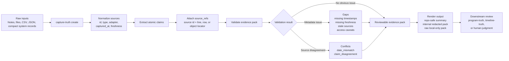

# Capture Truth

Status: v0.2.3 local-first implementation. MIT licensed. Requires Node.js 22 or newer.

`capture-truth` is a reusable evidence intake package for AI-agent TPM and operator workflows. It turns pasted text, local files, CSV/JSON exports, and read-only adapter outputs into a neutral `evidence_pack` with source snapshots, extracted claims, source refs, freshness metadata, validation gaps, unresolved conflicts, and portable renders.

It deliberately stops before status, risk, or timeline judgment. Use it to preserve what was captured and where it came from, then hand the pack to downstream workflows such as `program-truth` or `timeline-truth`.

Repository: https://github.com/hilmimuktitama/capture-truth

## Mental Model

`capture-truth` sits before analysis. It turns messy source material into an auditable evidence pack, then hands that pack to humans or downstream workflows for judgment.



The important boundary: `capture-truth` preserves evidence and source quality. It does not decide final status, risk, ownership, timeline, or program truth.

## Why It Helps

Without capture first, agents can flatten disagreement into a confident but unsupported summary. With `capture-truth`, stale notes, missing metadata, source conflicts, and sensitive raw content are surfaced before anyone writes a status report or timeline.

Example: if a local note says `DEMO-100` starts on `2026-06-01` but a system record says `2026-06-08`, `capture-truth` emits a `date_mismatch` conflict instead of silently choosing one.

## Truth Tools Surface

`truth-tools` is the aggregate CLI and MCP entrypoint bundled with this package. It exposes one consistent callable surface:

- `capture.create`, `capture.validate`, `capture.render`
- `program.reconcile`
- `timeline.create`, `timeline.validate`, `timeline.render`
- `benchmark.fixture`
- `truth_tools.doctor`

Use this surface when benchmarking or wiring agents that should not need separate setup for capture, program status, and timeline checks.

## Easy Way: Ask Your AI Agent To Set It Up

If you use an MCP-capable AI agent, start by asking the agent to install and configure `capture-truth` for you:

```text
Let's use capture-truth from https://github.com/hilmimuktitama/capture-truth.

Please inspect the repository README and setup docs, confirm this machine has Node.js 22 or newer, and configure an MCP server named capture-truth.

Prefer the npm package setup:

{
  "mcpServers": {
    "capture-truth": {
      "command": "npx",
      "args": ["-y", "--package=capture-truth", "capture-truth-mcp"]
    }
  }
}

If npm setup is unavailable, use a local checkout fallback: clone the GitHub repo, run npm install, and configure the MCP server with command node and args pointing to <repo>/src/mcp-server.js.

After setup, run the matching doctor command: for npm setup, run `npx -y --package=capture-truth capture-truth doctor`; for local checkout setup, run `node bin/capture-truth.js doctor` from the cloned repo. Then smoke-test the MCP server by calling create_evidence_pack with one text source, validate_evidence_pack, and render_evidence_pack as Markdown with export_profile set to repo-safe-summary.

Do not infer status, risk, ownership, or timeline truth. Only capture source-backed evidence, validation gaps, unresolved conflicts, and assumptions.
```

Once your agent confirms the MCP server works, give it source material and ask it to create, validate, and render an evidence pack.

## First Use

```json
{
  "sources": [
    {
      "id": "status-note",
      "type": "text",
      "path": "notes/status.txt",
      "captured_at": "2026-05-12T14:00:00Z",
      "freshness": "fresh",
      "content": "API contract is blocked by missing owner by 2026-05-20."
    }
  ]
}
```

Ask your agent:

```text
Use the capture-truth MCP server. Call create_evidence_pack with this source intake, then validate it and render the Markdown output with export_profile set to repo-safe-summary. Do not infer status, risk, ownership, or timeline truth.
```

## Install

Local checkout:

```bash
npm install
npm test
capture-truth doctor
truth-tools doctor --all
node src/mcp-server.js
node src/truth-mcp-server.js
```

See [docs/MCP-SETUP.md](docs/MCP-SETUP.md) for local and npm MCP config examples.

Npm package config:

```json
{
  "mcpServers": {
    "capture-truth": {
      "command": "npx",
      "args": ["-y", "--package=capture-truth", "capture-truth-mcp"]
    },
    "truth-tools": {
      "command": "npx",
      "args": ["-y", "--package=capture-truth", "truth-tools-mcp"]
    }
  }
}
```

CLI:

```bash
capture-truth doctor
capture-truth benchmark --json
capture-truth create --json-out < intake.json
capture-truth validate < evidence-pack.json
capture-truth render --format markdown < evidence-pack.json
capture-truth render --format markdown --export-profile repo-safe-summary < evidence-pack.json

truth-tools doctor --all
truth-tools capture.create --json-out < intake.json
truth-tools capture.validate < evidence-pack.json
truth-tools capture.render --format markdown --export-profile repo-safe-summary < evidence-pack.json
truth-tools program.reconcile < evidence-pack.json
truth-tools timeline.create --json-out < timeline-input.json
truth-tools timeline.validate < timeline.json
truth-tools timeline.render --format markdown < timeline.json
truth-tools benchmark.fixture --json-out < benchmark-case.json
```

## Capture MCP Tools

- `create_evidence_pack`: compile sources into neutral evidence pack JSON.
- `validate_evidence_pack`: report missing source refs, missing capture metadata, stale sources, duplicate source ids, and unresolved conflicts.
- `render_evidence_pack`: render as Markdown or JSON, optionally with an export profile.
- `refine_evidence_pack`: apply reviewer edits while preserving `source_refs` unless explicitly replaced.
- `run_capture_benchmark_fixture`: run a deterministic fixture covering stale sources, source conflicts, repo-safe export, and redaction checks.

## Aggregate MCP Tools

- `capture.create`: compile sources into neutral evidence pack JSON.
- `capture.validate`: validate captured evidence for metadata gaps and source conflicts.
- `capture.render`: render evidence with repo-safe, internal, or raw-local export profiles.
- `program.reconcile`: emit a standard program status object with confirmed facts, blockers, risks, unknowns, conflicts, assumptions, and write-back recommendations.
- `timeline.create`: create timelines with explicit `date_status` values.
- `timeline.validate`: validate timeline unknowns and milestone-blocking fields.
- `timeline.render`: render timelines without inventing dates for TBC or conflicting fields.
- `benchmark.fixture`: compare with-tools and without-tools benchmark outputs.
- `truth_tools.doctor`: smoke-test install, schema, render, adapters, and MCP availability.

## Export Profiles

`capture-truth` supports explicit export profiles when rendering evidence packs:

- `repo-safe-summary`: Markdown summary for committing to TPM repos. It omits raw source bodies and reports redaction warnings when source material contains common credential or sensitive-data markers.
- `internal-evidence-pack`: structured evidence output with raw `content` fields replaced by `content_redacted: true`.
- `raw-local-only`: full local render. Do not commit raw Jira, Confluence, customer, credential, or private operational data.

Use `repo-safe-summary` as the default for repo artifacts.

## Conflict Object

Unresolved source conflicts are emitted as actionable reconciliation objects:

```json
{
  "claim": "DEMO-2944 date",
  "source_a": {
    "system": "local-note",
    "value": "2026-05-27",
    "captured_at": "2026-05-14T00:00:00Z",
    "freshness": "stale"
  },
  "source_b": {
    "system": "jira",
    "value": "2026-06-02",
    "captured_at": "2026-05-14T01:00:00Z",
    "freshness": "fresh"
  },
  "conflict_type": "date_mismatch",
  "recommended_owner_action": "Assign an owner to reconcile the source disagreement and update the system of record."
}
```

The current detector handles direct claim disagreement and same-ticket date mismatches. It preserves the conflicting source metadata so downstream workflows can assign reconciliation work instead of flattening ambiguity.

## Adapter Contract

Adapters are read-only in v0. An adapter exposes:

- `id`
- `type`
- `read(input)`
- `metadata`
- `capabilities`

Every adapter result must preserve raw source identity and capture timestamp. The package includes local-file and fixture adapter helpers in `src/adapters.js`.

## Compact Intake Adapters

`capture-truth` includes read-only compact intake helpers for Jira and Confluence. They are designed for agents or wrappers that have already fetched source metadata and need a safe source-shaped record without storing raw issue descriptions or page bodies.

Jira compact intake preserves fields such as key, summary, status, assignee, parent, URL, `captured_at`, and freshness:

```js
import { createJiraCompactAdapter } from "capture-truth/src/adapters.js";

const source = createJiraCompactAdapter().read({
  key: "DEMO-2944",
  summary: "Example rollout",
  status: "In Progress",
  assignee: "Platform",
  updated_at: "2026-05-13T12:00:00Z",
  url: "https://example.atlassian.net/browse/DEMO-2944"
});
```

Confluence compact intake preserves page id/title/space/status/version/update metadata and URL. Both adapters set `metadata.raw_body_included: false` and compute `freshness` from `updated_at` unless a caller provides a freshness label.

## Doctor

`capture-truth doctor` smoke-tests:

- package install and Node version
- evidence pack and validation schema
- first-class conflict objects
- repo-safe render and redaction checks
- compact Jira/Confluence adapters
- MCP tool-surface availability

## Benchmark Fixture

`capture-truth benchmark --json` returns a deterministic fixture result for comparing capture behavior across agents and runs. The fixture includes:

- a stale local note
- fresh compact Jira evidence
- fresh compact Confluence evidence
- a same-ticket date conflict
- a readiness claim disagreement
- sensitive source text that must not appear in `repo_safe_summary`

The MCP tool `run_capture_benchmark_fixture` returns the same JSON shape. Use this before a real TPM review when you want to confirm that capture, validation, conflict detection, repo-safe rendering, redaction checks, and compact adapters are all working together.

## Boundaries

Good fits:

- capturing source material before analysis
- preserving provenance for messy program evidence
- creating a handoff artifact for status, risk, dependency, or timeline workflows
- surfacing source-quality gaps early

Poor fits:

- deciding whether a program is green/yellow/red
- reconstructing final program truth
- generating timelines or schedules
- writing to Jira, Confluence, Notion, or any external system

## Development

```bash
npm install
npm test
npm run check
npm pack --dry-run
```

See [CONTRIBUTING.md](CONTRIBUTING.md) before opening a pull request.
